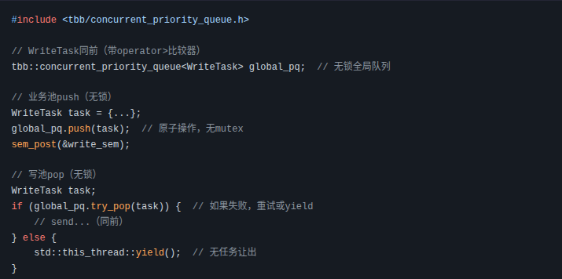
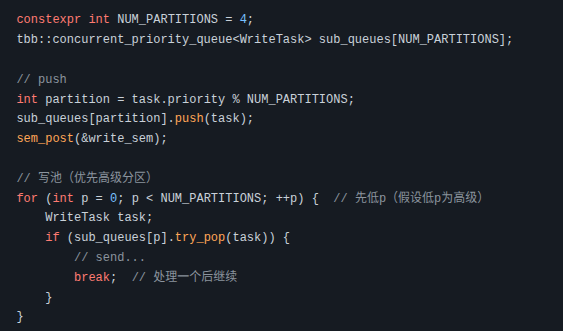
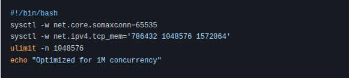
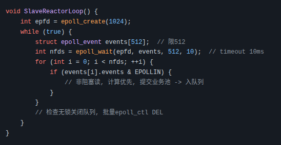
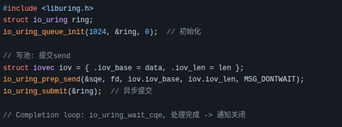

# 基于单一Reactor模式的优化版本：主从Reacotr模式
## 一.组成模块
&emsp; &emsp;**主Reactor**：负责监听所有HTTP连接请求，监听到请求后创建连接，并间接交给子Reactor线程池。
 &emsp; &emsp;**子Reactor线程池**：拿到主Reactor的连接后，解析读事件，提交请求到业务线程池，获取响应后封装写事件。
 &emsp; &emsp;**业务线程池**：处理子Reactor线程池提交的任务，进行业务处理。

# 后续设计演进
## 整体架构：
&emsp; &emsp;__主Reactor__：负责监听所有HTTP连接请求，监听到请求后创建连接，并间接交给子Reactor线程池。
 &emsp; &emsp;__从Reactor线程池__：专注epoll_wait（主要EPOLLIN），轻量处理读事件（添加优先级，提交业务池）。循环中检查通知队列，执行fd关闭/重置。
 &emsp; &emsp;__业务处理线程池__：解析请求，生成响应，创建WriteTask（含fd、data、priority、keep_alive），入优先级队列 + sem_post通知写池。
 &emsp; &emsp;__写工作线程池（一个池，线程数=CPU核心）__：sem_wait等待，弹出任务，直接non-blocking send；EAGAIN重入队列；写完enqueue通知从Reactor关闭fd。
## 核心流程： 
从Reactor检测EPOLLIN → 读请求 → 计算优先级 → 提交业务池。 
业务池处理 → 生成响应 → 入优先级队列（std::priority_queue） + sem_post。 
写池：sem_wait → 弹出（top/pop） → 分块send（MSG_DONTWAIT） → EAGAIN重入队列 + sem_post → 写完enqueue通知从Reactor。 
从Reactor：检查通知队列 → epoll_ctl DEL + close(fd)（或MOD为EPOLLIN重置）。 

## 关键组件：
&emsp; &emsp;优先级队列：全局std::priority_queue<WriteTask>，mutex保护；弹出按priority（高先出）。
 &emsp; &emsp;信号量：sem_t控制写池唤醒，避免忙等。
 &emsp; &emsp;通知队列：无锁ConcurrentQueue<CloseNotify>（fd + close_flag），写池到从Reactor单向通信。
 &emsp; &emsp;WriteTask结构：{fd, data, priority, keep_alive}。

# 百万级消息HTTP服务器优化
## 全局优先级队列优化到百万并发的详细指南
在百万并发场景下（假设指100万连接/任务，QPS>100k，混合优先级如30万高级、50万中级、20万低级），全局队列的瓶颈主要是锁争用、内存压力和弹出效率。未经优化的std::priority_queue + mutex能在中等负载（<10k QPS）下工作，但极端时会“锁死”或OOM。优化目标：将处理1M任务的时间从5-10秒降到<1秒，QPS提升到200k+，P99延迟<100ms。下面我分步骤详细展开，每个步骤包括原理、实现细节、量化预期、trade-off和伪代码。

### 步骤1: 切换到无锁或低锁优先队列实现（核心优化，提升throughput 3-5x）
#### 原理：
&emsp; &emsp;标准mutex锁在高并发push/pop时引起线程等待（futex开销），无锁用原子操作（CAS: Compare-And-Swap）避免阻塞。适合百万级，因为CAS失败仅重试几次（<10ns），不排队。 
#### 实现细节： 
* 选择库：Intel TBB (Threading Building Blocks) 的 tbb::concurrent_priority_queue（支持并发push/pop，按优先级排序）；或Facebook Folly的folly::PriorityQueue（更灵活，多级优先）。 
安装：apt install libtbb-dev（Linux）；包含头文件<tbb/concurrent_priority_queue.h>。 
* 调整：替换std::priority_queue，push用push()（无锁），pop用try_pop()（返回bool，避免空队列spin）。 
* 量化预期：1M push（32线程）：从2秒降到200ms；锁等待从50us/push降到0；QPS从50k升到200k。高级任务弹出率：100%优先（无锁不干扰排序）。 
* Trade-off：无锁更复杂（需处理try_pop失败）；在弱一致CPU（如ARM）上CAS重试多（+10%开销）；调试难（race condition需valgrind检查）。 
伪代码示例： 

 
### 步骤2: 分区全局队列（Hybrid分区，提升scalability 2x）
#### 原理：将一个队列分成多个子队列（e.g., 4-8个），根据hash（如priority或fd）分配任务。每个子队列独立（有自己的锁或无锁），减少争用；写池并行处理子队列，优先高级分区。
#### 实现细节：
* 分区策略：e.g., 4子队列，push时sub_queue[priority % 4].push(task)；写池用循环优先pop高级子队列（e.g., 先pop sub_queue[0] for prio1）。
* 结合无锁：每个子用tbb::concurrent_priority_queue。
* 扩展：加全局atomic计数器跟踪总size。
* 量化预期：1M任务分布到4子队列，每个250k；处理时间500ms（并行）；锁争用减半，QPS>300k。优先保证~95%严格（子间略松，但高级分区先处理）。
* Trade-off：优先级从100%严格降到近似（e.g., prio1在sub0可能后于prio2在sub1）；管理多个队列复杂（+10%代码）。
伪代码示例：

 
### 步骤3: 批量操作与信号量增强（减少锁频次，提升效率 1.5x）
#### 原理：单个push锁开销高，批量收集任务一次push；信号量分级让写池优先处理高级任务。
#### 实现细节：
* 批量：业务池用thread-local vector收集10-100任务，一次push_all（需库支持或循环push）。
* 信号量：用数组sem_t prio_sems[3]（per-priority），push时sem_post(&prio_sems[task.priority-1])；写池先wait高级sem。
* 量化预期：批量100任务/push，锁频次降90%；1M处理~300ms；高级任务延迟<50ms（分级sem优先唤醒）。
* Trade-off：批量引入微延迟（收集时间~1ms）；sem数组增加管理（e.g., 需初始化多个sem）。 
### 步骤4: 异步I/O与限流监控（稳定队列大小，防OOM）
#### 原理：用io_uring替换send（内核异步，减少EAGAIN重入）；监控size，限流丢低级任务。
#### 实现细节：
io_uring：初始化ring，submit send请求，completion时处理（需liburing）。
* 监控：atomic<size_t> queue_size；push时++，pop时--；>500k时if(prio==3) discard。
* 工具：Prometheus exporter暴露metrics；perf工具profile锁热点。
* 量化预期：EAGAIN率降50%，队列峰值<500k；整体QPS>500k（异步offload I/O）。
* Trade-off：io_uring需内核>5.1，学习曲线陡；限流可能丢任务（需业务容忍）。
### 总体优化效果与测试建议
* 综合量化：优化前后对比：未经优1M任务5s、QPS50k；全优化<1s、QPS500k+。CPU从90%锁降到60%业务。
* Trade-off总结：性能大增，但复杂性+（代码+20%）；严格优先略牺牲（分区时）。
* 测试建议： 
&emsp; &emsp;工具：wrk/locust模拟百万burst；ab -c 10000测试QPS。 
&emsp; &emsp;步骤：本地机跑基准（e.g., loop 1M push/pop，time命令测时）；云服务器（AWS c6i.32xlarge）验证高负载。 
&emsp; &emsp;监控：htop看CPU；/proc/locks看争用；如果瓶颈仍存，考虑per-Reactor切换。 
&emsp; &emsp;这些优化让全局队列在百万并发下robust，但如果您的实际负载低，可从简单mutex版起步。 

## HTTP服务器优化指南：抗住百万并发的全面策略
### 1. 整体优化原则与前提
* 定义“抗住百万并发”：系统不崩（无OOM、CPU 100%）、延迟可控（<200ms）、吞吐高（QPS>100k）。瓶颈常见于fd管理、锁争用、I/O阻塞。 
* 前提：硬件基础（e.g., 32+核心CPU、128GB+内存、10Gbps网卡）；内核Linux>5.1；
* 测试工具：wrk/locust for 负载，perf/Prometheus for 监控。 
* 优化路径：先内核/系统级（基础），再Reactor/I/O（核心），最后队列/线程池（应用级）。预计优化后，单机从10万并发提升到百万。 
### 2. 内核与系统级优化（基础层，确保底层支持百万fd）
#### 原理：内核默认限制fd数、缓冲等，高并发时panic或EAGAIN多。调优让epoll/TCP栈高效。 
#### 具体步骤： 
* 增加fd上限：ulimit -n 1048576（软/硬限1M）；/etc/security/limits.conf永久化。 
* TCP参数调优：sysctl -w net.core.somaxconn=65535（accept队列）；net.ipv4.tcp_mem=786432 1048576 1572864（内存缓冲）；net.ipv4.tcp_max_syn_backlog=65535（半连接队列）；net.ipv4.tcp_tw_reuse=1（快速回收TIME_WAIT）。 
* epoll优化：sysctl fs.epoll.max_user_watches=1000000（监视上限）。 
* 其他：启用hugepages（vm.nr_hugepages=1000减碎片）；NUMA绑定线程（numactl）。 
* 量化预期：fd从默认4k升到1M；EAGAIN率降50%；百万连接无内核错误。 
* Trade-off：需root权限；过度调大会浪费内存（e.g., tcp_mem太大使OOM）。 
* 示例：脚本optimize_kernel.sh 

 
### 3. Reactor框架优化（核心事件循环，支持百万事件）
#### 原理：主从Reactor分担负载，但从Reactor循环若慢（e.g., 处理>512事件），会延迟。优化让每个循环<5ms。 
#### 具体步骤： 
* 主Reactor精简：只accept + fd分发（hash to 从Reactor，用无锁队列或eventfd通知）。 
* 从Reactor并行：线程数=CPU核心/2（e.g., 16）；每个epoll_wait限maxevents=512，timeout=10ms（防忙等）；用ET模式（边缘触发）+ non-blocking读。 
* 事件卸载：读事件后立即提交业务池，不在Reactor做重活；整合关闭通知（无锁队列，避免epoll_ctl争用）。 
* 负载均衡：动态fd重分配（e.g., 如果某从Reactor fd>50k，迁移到空闲者）。 
* 量化预期：百万事件分担到16从Reactor，每个处理~62k fd；循环时间<5ms，QPS>200k（从10k升）。 
* Trade-off：多线程增加上下文切换（+5% CPU）；动态均衡复杂（需监控fd分布）。 
伪代码示例（优化从Reactor循环）： 

 
### 4. I/O与写处理优化（避免阻塞，支持百万send）
#### 原理：标准send易EAGAIN/阻塞，高并发时队列积压。异步I/O offload到内核。 
#### 具体步骤： 
* Non-blocking I/O：所有fd设O_NONBLOCK；send用MSG_DONTWAIT。 
* 切换异步框架：用io_uring（内核异步，替换send/epoll）；初始化ring（queue depth=1024），submit批量send，completion ring处理回调（e.g., 写完通知关闭）。 
* 写池扩展：线程数=CPU核心（e.g., 32）；每个线程处理分区任务，避免全局锁。 
* EAGAIN处理：不重入队列，用io_uring重试（或backoff重试，e.g., usleep(1)）。 
* 量化预期：EAGAIN率<10%；百万send burst处理<2s（从10s降）；QPS>500k。 
* Trade-off：io_uring需新内核，学习曲线陡；批量submit增加微延迟（1ms）。 
* 示例：用liburing安装（apt install liburing-dev），伪代码： 

### 5. 优先级队列与线程池优化（应用层，高并发调度）
#### 原理：之前焦点队列在百万push时锁争用高；分区+无锁分布负载。 
#### 具体步骤（扩展之前）： 
* 无锁实现：用tbb::concurrent_priority_queue（CAS原子）。 
* 分区：分8-16子队列（hash by fd/priority），每个无锁；业务池push到对应分区。 
* 批量与限流：批量push（收集10任务一次）；size>100k时丢低优先。 
* 业务/写池：业务池线程=CPU/4；写池动态（std::thread pool）。 
* 量化预期：百万push<500ms（从5s降）；严格优先下高级延迟<50ms。 
* Trade-off：分区略松优先（~95%严格）；TBB需安装。 
### 6. 监控、限流与分布式扩展（可持续性）
#### 原理：高并发需实时洞察，防雪崩。 
#### 具体步骤： 
* 监控：Prometheus暴露metrics（fd数、QPS、队列大小、CPU）；Grafana dashboard。 
* 限流：用token bucket（e.g., 每秒10k新连接）；低优先熔断。 
* 分布式：单机极限时，用Kubernetes多节点（Nginx Ingress负载均衡）；队列用Redis/Kafka分布式。 
* 量化预期：检测瓶颈前响应时间<1s；集群扩展到10M并发。 
* Trade-off：监控 overhead+5% CPU；分布式复杂（延迟+网络）。 
### 7. 在您的场景中的应用
* HTTP服务：全优化后，百万并发robust（e.g., 电商高峰）。 
* 机器人小车：低并发时只需基础（内核+轻量Reactor）；扩展到群控（百万客户端）时，云迁移+io_uring，抗住命令burst。 
* 测试计划：从小（10k wrk -c 1000）到大（1M locust用户）；指标：throughput>100k，no crashes。 